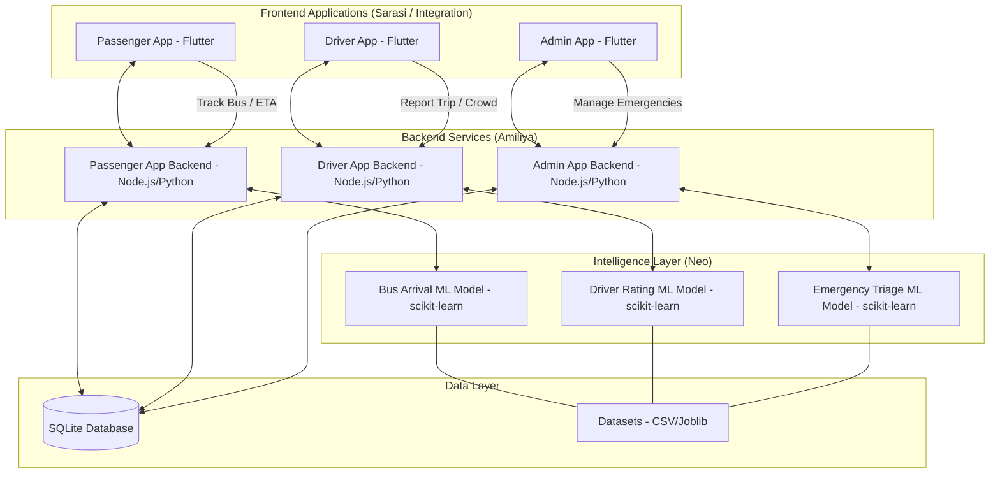

# System Architecture: Smart City Public Transport & Emergency Response

This document outlines the architecture of the **Smart City Management System**, which integrates public transportation monitoring with an intelligent emergency triage system.

## High-Level Architecture Diagram

## Component Breakdown

### 1. Frontend Applications (Sarasi & Integration)
- **Passenger App:** Real-time tracking, ETA predictions, bus rating, and emergency alerts.
- **Driver App:** Trip management, NFC authentication, crowd monitoring, and emergency response.
- **Admin App:** Oversight of the entire system, prioritizing emergency incidents.

### 2. Backend Services (Amiliya)
- **Modular Backends:** Dedicated backend services for each application type (Passenger, Driver, Admin) to ensure scalability and separation of concerns.
- **API Layer:** Provides RESTful endpoints for the frontend applications to communicate with the system.

### 3. Intelligence Layer (Neo)
- **Bus Arrival Prediction:** Uses historical trip data to provide accurate ETA for passengers.
- **Driver Rating Analysis:** Evaluates driver performance based on passenger feedback.
- **Emergency Triage:** Automatically prioritizes emergency reports based on severity, victims, and location factors.

### 4. Data Layer
- **Supabase:** Used for reliable, scalable data storage of user profiles, trips, settings, and ratings using PostgreSQL.
- **Datasets:** CSV and Joblib files store the historical data and trained machine learning models used by the Intelligence Layer.
