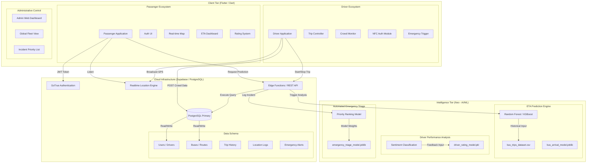

# SL BusTrack - Comprehensive System Architecture & Use Case Documentation

This document provides a granular view of the **SL BusTrack** ecosystem, detailing the interactions between high-performance clients, intelligent machine learning layers, and scalable cloud infrastructure.

## 🏗️ Detailed System Architecture



## 📋 Granular Use Case Diagram

```mermaid
useCaseDiagram
    actor "Passenger" as P
    actor "Driver" as D
    actor "Admin" as A
    actor "Intelligence Layer" as AI

    package "SL BusTrack Ecosystem" {
        usecase "Secure Authentication" as UC_Auth
        usecase "Real-time Fleet Tracking" as UC_Track
        usecase "Predictive ETA View" as UC_ETA
        usecase "NFC Driver Validation" as UC_NFC
        usecase "Crowd Density Reporting" as UC_Crowd
        usecase "Instant Emergency Broadcast" as UC_Alert
        usecase "Automated Incident Triage" as UC_Triage
        usecase "Driver Performance Rating" as UC_Rate
        usecase "Fleet & Route Management" as UC_Manage
        usecase "Resource Priority Allocation" as UC_Ops
    }

    P --> UC_Auth
    P --> UC_Track
    P --> UC_ETA
    P --> UC_Rate
    P --> UC_Alert

    D --> UC_Auth
    D --> UC_NFC
    D --> UC_Crowd
    D --> UC_Alert

    A --> UC_Auth
    A --> UC_Manage
    A --> UC_Ops

    AI -- "Provides Ranking" --> UC_Triage
    AI -- "Provides Estimates" --> UC_ETA
    
    UC_Alert ..> UC_Triage : <<include>>
    UC_Triage ..> UC_Ops : <<inform>>
```
