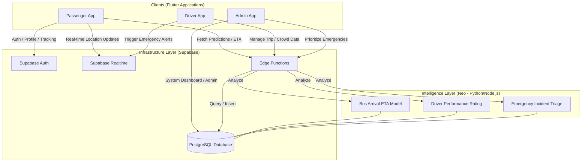

# SL BusTrack - Architectural & Functional Documentation

This document contains the core diagrams for the **SL BusTrack** system, a smart city public transport and emergency response platform.

## System Architecture Diagram



## Use Case Diagram

```mermaid
useCaseDiagram
    actor "Passenger" as P
    actor "Driver" as D
    actor "Admin" as A

    package "SL BusTrack System" {
        usecase "Login / Register" as UC1
        usecase "Track Bus Location" as UC2
        usecase "View Bus ETA" as UC3
        usecase "Rate Driver" as UC4
        usecase "Submit Emergency Alert" as UC5

        usecase "Start / End Trip" as UC6
        usecase "Update Crowd Status" as UC7
        usecase "Manage Bus Route" as UC8

        usecase "Monitor All Buses" as UC9
        usecase "Manage Drivers / Routes" as UC10
        usecase "Respond to Emergencies" as UC11
    }

    P --> UC1
    P --> UC2
    P --> UC3
    P --> UC4
    P --> UC5

    D --> UC1
    D --> UC6
    D --> UC7
    D --> UC8
    D --> UC5

    A --> UC1
    A --> UC9
    A --> UC10
    A --> UC11
```
